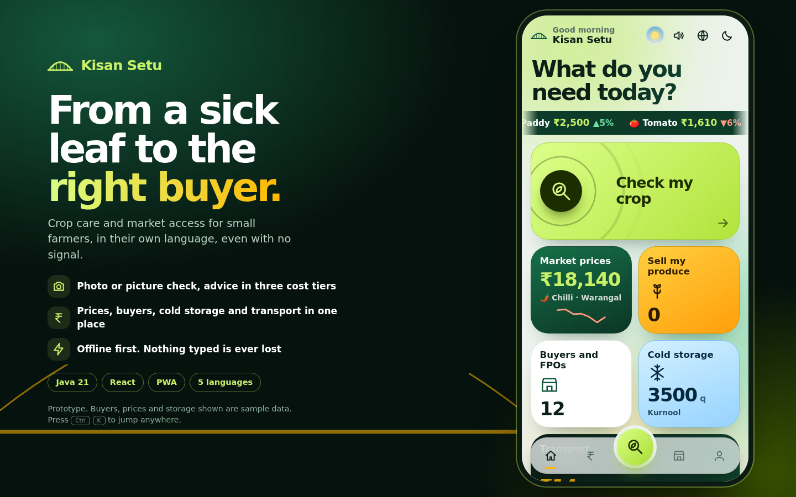

# Kisan Setu (Farmer's Bridge) - Java + React

Crop care and direct market access for small farmers: photo or picture-based crop problem check with tiered treatment
advice, mandi prices, buyers and FPOs, cold storage, transport and produce listing. An installable web app (PWA) in English,
Telugu, Hindi, Tamil and Kannada. **Offline-first: nothing a farmer enters is lost when the signal drops.**

**Stack:** Java 21 backend (JDK only, no Maven dependencies) + React (plain JavaScript/JSX) + IndexedDB + service worker.

Status: **working prototype.** Buyers, FPOs, storage, transporters and default prices are **sample data**, labelled "Sample" in the app.

## Run it (2 commands, Java 21+ required)

    ./run.sh                     # compiles the backend and starts it on http://127.0.0.1:8080  (admin console: /admin)

The first start prints a one-time admin PIN. To choose your own, set `ADMIN_PHONE` and `ADMIN_PIN` before the first run.
The React app is already built into `backend/src/main/resources/public`. To change the front end:
`./build-frontend.sh` (Node 18+), or `cd frontend && npm install && npm run watch`.

| Environment variable | Purpose |
|---|---|
| `PORT`, `HOST` | Listen address (default 8080 / 127.0.0.1; use `HOST=0.0.0.0` in containers) |
| `KS_DATA` | Data folder: `db.json`, `uploads/`, `secret.key` (default `./data` next to where you start it) |
| `ANTHROPIC_API_KEY` | Turns on photo diagnosis (Claude vision). Off without it; the picture route still works |
| `ANTHROPIC_MODEL`, `AI_DAILY_LIMIT` | Default `claude-sonnet-5`; photo checks per user per day (default 20) |
| `DATA_GOV_API_KEY` | Turns on live Agmarknet prices (Andhra Pradesh, Telangana). Otherwise sample prices |
| `ADMIN_PHONE`, `ADMIN_PIN` | Bootstrap admin account (first start only) |
| `TRUST_PROXY` | Number of proxies in front of the server (default 0; use 1 on most hosts) |

## The design: "Neon Field"

- Bento home screen whose tiles show **live numbers** (best price, free cold-storage space, rate per km) before you tap.
- 3D tilt with pointer-following glare, a scrubbable price chart, camera viewfinder with scan sweep, animated confidence ring,
  four-dot PIN entry, confetti when produce is posted, prices that count up, and a bridge that draws itself under every title.
- Dark "night field" theme, a `Ctrl/Cmd + K` command palette, and on a laptop a story panel beside a live phone frame.
- Built from CSS and inline SVG only (no web fonts or images to download). All motion is disabled for people who prefer reduced motion.

## Test it

    python3 tools/test_api.py          # 47 API checks (compiles + boots the Java server and a stand-in AI)
    python3 tools/test_persistence.py  # 7 checks: data survives a server restart
    python3 tools/e2e_ui.py            # 27 browser checks incl. network off/on, sync, roles, admin (needs Playwright + Chromium)

`tools/mock_ai.py` is a **test-only** stand-in for the Anthropic API. It returns canned answers and never looks at the image.

## Layout

    backend/src/main/java/setu/   Main (server, static hosting), Api (all routes), Store (durable store), Auth, Ai, Live, Json, Data, Cfg, Util
    backend/src/main/resources/   kb.json, seed.json, public/ (the built React apps)
    frontend/src/                 React source: core/ (state, sync, offline DB), ui/ (design components), screens/, admin/
    frontend/public/              manifest, service worker, translations (i18n.json), data files
    tools/                        tests, generators (gen_*.py), screenshots, demo recorder
    docs/screens/                 screenshots        demo/kisan-setu-demo.mp4   captioned walkthrough

Content is generated from one place: `python3 tools/gen_i18n_kb.py` (translations + crop knowledge base) and
`python3 tools/gen_seed.py` (sample data), then copy the JSON into `frontend/public/data` and `backend/src/main/resources`.

## Roles

Farmer and buyer register themselves (mobile number + 4-digit secret number). Buyers can browse farmers' produce but see phone numbers only
after an admin approves them. Admin is created at first start and cannot be self-registered. Guests can use the symptom check, prices and directories
without an account. Roles are enforced on the server.

## Why the Java backend has no Spring Boot

It uses the JDK's built-in HTTP server, crypto and HTTP client, so it compiles and runs anywhere with just Java 21 and could be tested end to end
in an offline build environment. The layers (routes in `Api`, storage behind `Store`, AI behind `Ai`) map one-to-one onto controllers/services/repositories
if you want to port it to Spring Boot; that port has not been done or tested.

## Known limitations (read before a pilot)

- **AI accuracy is unmeasured.** The photo pipeline was only tested against a stand-in AI. Run real leaf photos of your crops and record how often the match is right.
- **Live Agmarknet prices are unverified.** The code path has not been run against the live service.
- **Sample data.** Replace the directory through real onboarding.
- **Advice and translations need expert review** (agronomist/KVK; native speakers for Telugu, Hindi, Tamil, Kannada).
- **Storage is a JSON file with atomic writes**: durable and fine for a pilot, single instance only. Swap `Store.java` for PostgreSQL to scale.
- **PIN-only sign-in** (no SMS code). Fonts: system fonts; bundle a Noto Indic subset for phones without them.
- **Not tested on real low-end phones or with farmers.** The Maven `pom.xml`, `Dockerfile` and hosting steps in `DEPLOY.md` were written but not executed.
# Kisan_Setu
